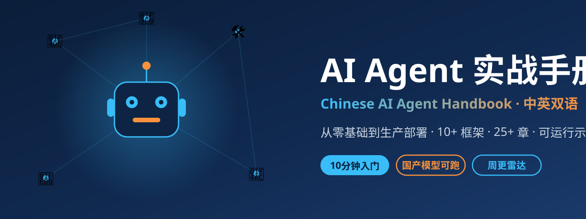

<div align="center">



# 🤖 AI Agent 实战手册（中文为主 · English in progress）

### 不是教你"会用"某个框架，而是让你理解 Agent 的本质 —— 在任何框架面前游刃有余

**面向中文开发者的 AI Agent 系统学习指南** · 从零搭建到生产部署

🚀 10 分钟零基础上手 · 10+ 框架全覆盖 · 26+ 章完整教程 · 9+ 可运行示例 · 国产模型可跑 · 中英术语对照

[](https://github.com/Xwh630/ai-agent-handbook)
[](https://github.com/Xwh630/ai-agent-handbook/fork)
[](https://github.com/Xwh630/ai-agent-handbook/commits/main)
[](https://github.com/Xwh630/ai-agent-handbook/graphs/contributors)
[](https://opensource.org/licenses/MIT)
[](https://www.python.org/)
[](https://xwh630.github.io/ai-agent-handbook/)
[]()
[]()
[]()

### ⭐ 如果这份手册对你有帮助，请点亮 Star，让更多中文开发者看到它！

</div>

> **框架覆盖**：[LangGraph](https://github.com/langchain-ai/langgraph) 40.3K⭐ · [CrewAI](https://github.com/crewAIInc/crewAI) 57.5K⭐ · [AutoGen](https://github.com/microsoft/autogen) 60.6K⭐ · [Dify](https://github.com/langgenius/dify) 153.3K⭐ · [LlamaIndex](https://github.com/run-llama/llama_index) 51.8K⭐ · [OpenAI Agents](https://github.com/openai/openai-agents-python) 28.9K⭐ · [Mastra](https://github.com/mastra-ai/mastra) 27.4K⭐ · [Ollama](https://github.com/ollama/ollama) 179.3K⭐ · [DeepSeek Harness](https://github.com/deepseek-ai/deepseek-harness) 137K⭐

> 📡 **新增「Agent Radar」周刊**：[每周一期，追踪 Agent 圈最新动态](radar/) · 🏗️ **新增[第 25 章：Harness Engineering](chapters/25-harness-engineering.md)** —— 2026 年 Agent 工程的核心竞争力

---

## 🌐 语言 / Language

| 语言 | 入口 |
|------|------|
| 🇨🇳 **简体中文（主语言）** | [README.md](README.md) |
| 🇺🇸 **English (in progress)** | [English README](en/README.md) |
| 📊 **翻译进度** | [Translation Status](en/TRANSLATION_STATUS.md) |

---

## 🗺️ 迭代路线图

本手册有明确的迭代计划，每周更新。想知道接下来会有什么内容？看 [ROADMAP.md](ROADMAP.md)。

> 📌 **当前版本**：v0.2.0 · 保鲜与基建 |

---

## 🆕 新手看这里（零基础必读）

> **完全没接触过 AI Agent？** 从这里开始，10 分钟跑通你的第一个 Agent！

| 入口 | 适合人群 | 耗时 |
|------|---------|------|
| 🚀 **[第 0 章：新手快速入门](chapters/00-quickstart.md)** | 完全零基础 | ⏱️ 10 分钟 |
| 📖 **[中英对照术语表](chapters/99-glossary.md)** | 看文档遇到不懂的词 | ⏱️ 随时查 |
| 🐳 **[Docker 一键环境](#方案-1docker-一键启动最省事推荐新手)** | 不想装 Python 环境 | ⏱️ 2 分钟 |
| 🛠️ **[第 20 章 · Codex CLI](chapters/20-codex-cli.md)** | 想用 OpenAI Codex | ⏱️ 15 分钟 |
| 🛠️ **[第 21 章 · DeepSeek Harness](chapters/21-deepseek-harness.md)** | 想批量自动化 + SWE-bench | ⏱️ 20 分钟 |
| 🛠️ **[第 22 章 · Continue 编辑器](chapters/22-continue-editor.md)** | 想用 AI 编码辅助 | ⏱️ 10 分钟 |
| 🛠️ **[第 23 章 · Aider 代码助手](chapters/23-aider-codestory.md)** | 想在终端用 AI 编程 | ⏱️ 10 分钟 |
| 🛠️ **[第 24 章 · Trae IDE](chapters/24-trae-ide.md)** | 想体验 AI 原生 IDE | ⏱️ 10 分钟 |

### 新手友好特点

- ✅ **生活化比喻**：把 Agent 比作"全能管家"，一看就懂
- ✅ **图文并茂**：Mermaid 流程图 + 表格，不烧脑
- ✅ **代码可复制**：完整代码直接复制运行，不用改一行
- ✅ **国产模型可用**：支持 DeepSeek、智谱、通义千问，注册送额度
- ✅ **双语文档**：中文为主，英文同步更新

---

## 🌟 项目亮点

### 为什么选择这本手册？

```
┌─────────────────────────────────────────────────────────────┐
│  ✅ 新手零门槛 — 第 0 章 10 分钟跑通第一个 Agent             │
│  ✅ 中文内容稀缺 — 大多数优质教程是英文的，且版本更新快        │
│  ✅ 覆盖全面 — 从入门到生产级应用，一站式掌握                 │
│  ✅ 实战导向 — 每个章节都有可运行的代码                        │
│  ✅ 框架完整 — 10+ 主流 Agent 框架全覆盖                      │
│  ✅ 选型清晰 — 帮你快速找到最适合你场景的框架                 │
│  ✅ 持续保鲜 — CI 自动监控版本更新，过期内容自动标记           │
│  ✅ 每周更新 — Radar 周刊 + 版本化迭代，紧跟 2026 最新技术    │
└─────────────────────────────────────────────────────────────┘
```

### 适合谁读？

| 读者类型 | 阅读路径 |
|---------|---------|
| **零基础新手** | 第 0 章(10分钟入门) → 第 1 章 → 第 7 章(Dify) → 第 12 章(Ollama) |
| **初学者** | 第 1 章 → 第 2 章 → 第 7 章(Dify) → 第 12 章(Ollama) |
| **进阶开发者** | 第 1 章 → 第 3 章(LangGraph) → 第 4 章(CrewAI) → 第 17 章(实战) |
| **架构师** | 第 13 章(协作模式) → 第 14 章(记忆) → 第 16 章(可观测性) → 第 17 章(全栈) |

---

## 📖 目录

### 新手专区（必读）

| 章节 | 标题 | 难度 | 内容概要 |
|------|------|------|----------|
| 第 0 章 | 🚀 新手快速入门 | ⭐ 零门槛 | 10 分钟跑通第一个 Agent |
| 术语表 | 📖 中英对照术语表 | - | 110+ 术语通俗解释（含 2026 前沿新词） |

### 入门篇

| 章节 | 标题 | 难度 | 内容概要 |
|------|------|------|----------|
| 第 1 章 | AI Agent 基础概念 | ⭐ 入门 | Agent 本质、核心组件、ReAct 模式 |
| 第 2 章 | 从零手写 ReAct Agent | ⭐⭐ 基础 | 完整实现一个最小可用 Agent |
| 第 7 章 | Dify 低代码可视化平台 | ⭐ 入门 | 可视化拖拽构建应用 |
| 第 12 章 | Ollama 本地大模型部署 | ⭐ 入门 | 隐私保护、离线场景 |

### 进阶篇

| 章节 | 标题 | 难度 | 内容概要 |
|------|------|------|----------|
| 第 3 章 | LangGraph 图编排实战 | ⭐⭐⭐ 进阶 | 复杂工作流、状态机、检查点 |
| 第 4 章 | CrewAI 多智能体协作 | ⭐⭐⭐ 进阶 | 角色化团队、任务分配 |
| 第 5 章 | AutoGen / MAF 对话驱动 | ⭐⭐⭐ 进阶 | 多 Agent 研究、迭代求解 |
| 第 6 章 | LlamaIndex RAG 知识库 | ⭐⭐⭐ 进阶 | 文档检索、向量数据库 |
| 第 8 章 | OpenAI Agents SDK | ⭐⭐ 基础 | 轻量级多 Agent |
| 第 9 章 | Claude Agent SDK | ⭐⭐ 基础 | Anthropic 官方工具 |
| 第 10 章 | Mastra TypeScript Agent | ⭐⭐⭐ 进阶 | TS 优先的 Agent 框架 |
| 第 11 章 | MCP 协议完全指南 | ⭐⭐⭐ 进阶 | 标准化工具连接协议 |
| 第 15 章 | Token 成本优化策略 | ⭐⭐ 基础 | 生产环境成本控制 |
| 第 18 章 | 选型决策树与最佳实践 | ⭐⭐ 基础 | 如何选择合适的框架 |
| 第 19 章 | Agent 通用工具箱 | ⏳ 规划中 | 工具注册、审批网关、成本追踪等 |

### 高级篇

| 章节 | 标题 | 难度 | 内容概要 |
|------|------|------|----------|
| 第 13 章 | 多 Agent 协作模式详解 | ⭐⭐⭐⭐ 高级 | 6 种协作模式与决策树 |
| 第 14 章 | 记忆系统与状态管理 | ⭐⭐⭐ 进阶 | Mem0、向量记忆、持久化 |
| 第 16 章 | 调试、监控与可观测性 | ⭐⭐⭐ 进阶 | LangSmith、日志、追踪 |
| 第 17 章 | 全栈实战：研究报告生成系统 | ⭐⭐⭐⭐ 高级 | 整合所有技术的完整项目 |

### 🏗️ 工程化专题（生产级必备）

| 章节 | 标题 | 难度 | 内容概要 |
|------|------|------|----------|
| 第 25 章 | [Harness Engineering 驾驭工程](chapters/25-harness-engineering.md) 🆕 | ⭐⭐⭐ 进阶 | 任务边界、上下文管理、状态持久化、失败恢复、权限体系 |

### 📡 Agent Radar 周刊

> 每周一期，追踪 Agent 圈最新项目、框架版本、论文与玩法 —— [进入栏目](radar/)

| 期数 | 日期 | 内容 |
|------|------|------|
| [第 2 期](radar/2026-W41.md) 🆕 | 2026-10-09 | Skills 时代开启、MCP 无状态化、上下文工程崛起 |
| [第 1 期](radar/2026-W40.md) | 2026-10-02 | Harness 元年、Skills 生态爆发、Computer Use 走向生产 |

### 🛠️ Agent 工具详细教程

| 章节 | 标题 | 难度 | 内容概要 |
|------|------|------|----------|
| 第 20 章 | OpenAI Codex CLI 详解 | ⭐⭐ 基础 | MCP 集成、四种审批模式、沙箱隔离 |
| 第 21 章 | DeepSeek Harness（dsh） | ⭐⭐⭐ 进阶 | 四种模式、SWE-bench 评测、500+ 插件 |
| 第 22 章 | Continue 编辑器 | ⭐⭐ 基础 | VSCode/JetBrains 插件、自定义模型、MCP 支持 |
| 第 23 章 | Aider 代码助手 | ⭐⭐ 基础 | 多模型支持、Git 集成、会话恢复 |
| 第 24 章 | Trae IDE | ⭐ 入门 | AI 原生 IDE、Agent 工作流、内置工具链 |

### 附录

| 附录 | 内容 |
|------|------|
| 附录 A | 框架对比总表（10+ 框架详细对比） |
| 附录 B | 常见错误排查手册 |
| 附录 C | 学习资源与社区链接 |

---

## 🚀 快速开始

### 方案 1：Docker 一键启动（最省事，推荐新手）

> 不需要安装 Python，一条命令搞定！

```bash
# 克隆项目
git clone https://github.com/Xwh630/ai-agent-handbook.git
cd ai-agent-handbook

# 方法 A：进入开发环境（交互式）
docker compose up -d
docker compose run dev bash

# 方法 B：直接运行示例（一行命令）
docker build -t agent-handbook .
docker run -it --rm \
  -e OPENAI_API_KEY=你的key \
  -v $(pwd):/workspace agent-handbook \
  python examples/01-react-agent/main.py

# 可选：同时启动 Ollama 本地大模型（完全免费）
docker compose up ollama
```

### 方案 2：本地 Python（常规方式）

```bash
# 1. 安装 Python 3.10+（官网下载，勾选 Add to PATH）
python3 --version

# 2. 克隆项目并安装依赖
git clone https://github.com/Xwh630/ai-agent-handbook.git
cd ai-agent-handbook
pip install -r requirements.txt

# 3. 配置 API Key
cp .env.example .env
# 编辑 .env 填入你的 Key（OpenAI / DeepSeek / 智谱等均可）
```

### 运行示例

```bash
# 1. 新手入门示例（最基础，先跑这个！）
cd examples/01-react-agent
python main.py

# 2. LangGraph 工作流
cd examples/02-langgraph-workflow
python main.py

# 3. CrewAI 多智能体
cd examples/03-crewai-team
python main.py

# 4. RAG 知识库
cd examples/09-rag-knowledge
python main.py
```

---

## 🎯 核心框架速览

| 框架 | GitHub Stars | 语言 | 定位 | 最佳场景 | 推荐指数 |
|------|--------------|------|------|----------|----------|
| **LangGraph** | 40.3K ⭐ | Python/TS | 图状态机编排 | 复杂工作流、生产级系统 | ⭐⭐⭐⭐⭐ |
| **CrewAI** | 57.5K ⭐ | Python | 角色化多 Agent | 快速原型、团队协作模拟 | ⭐⭐⭐⭐⭐ |
| **AutoGen (MAF)** | 60.6K ⭐ | Python/.NET | 对话驱动协作 | 多 Agent 研究、迭代求解 | ⭐⭐⭐⭐ |
| **Dify** | 153.3K ⭐ | Python/TS | 低代码可视化 | 产品验证、非技术人员 | ⭐⭐⭐⭐⭐ |
| **LlamaIndex** | 51.8K ⭐ | Python | RAG 数据接入 | 知识库问答、文档检索 | ⭐⭐⭐⭐⭐ |
| **OpenAI Agents SDK** | 28.9K ⭐ | Python | 轻量级多 Agent | 快速开发、OpenAI 生态 | ⭐⭐⭐⭐ |
| **Claude Agent SDK** | 8.0K ⭐ | Python | Anthropic 官方 | Claude Code 集成 | ⭐⭐⭐ |
| **Mastra** | 27.4K ⭐ | TypeScript | TS 优先 Agent | 前端/全栈开发者 | ⭐⭐⭐ |
| **Ollama** | 179.3K ⭐ | Go | 本地大模型运行 | 隐私保护、离线场景 | ⭐⭐⭐⭐⭐ |
| **MCP** | 标准协议 | 多语言 | 工具标准化连接 | 跨框架工具互通 | ⭐⭐⭐⭐⭐ |

> Stars 数据截至 2026 年 10 月，来自 GitHub。每周自动更新。

---

## 🔗 生态联动

本手册不是孤岛——它与整个 AI Agent 开源生态深度联动。学习时配合以下官方仓库与社区资源效果最佳：

### 框架官方仓库

| 生态项目 | 说明 | 本手册对应章节 |
|----------|------|----------------|
| [langchain-ai/langgraph](https://github.com/langchain-ai/langgraph) | 图状态机编排框架 | [第 3 章](chapters/03-langgraph.md) |
| [crewAIInc/crewAI](https://github.com/crewAIInc/crewAI) | 角色化多 Agent 框架 | [第 4 章](chapters/04-crewai.md) |
| [microsoft/autogen](https://github.com/microsoft/autogen) | 微软对话式 Agent 框架 | [第 5 章](chapters/05-autogen.md) |
| [run-llama/llama_index](https://github.com/run-llama/llama_index) | RAG 数据接入框架 | [第 6 章](chapters/06-llamaindex-rag.md) |
| [langgenius/dify](https://github.com/langgenius/dify) | 低代码 AI 应用平台 | [第 7 章](chapters/07-dify.md) |
| [openai/openai-agents-python](https://github.com/openai/openai-agents-python) | OpenAI 官方 Agents SDK | [第 8 章](chapters/08-openai-agents.md) |
| [anthropics/anthropic-sdk-python](https://github.com/anthropics/anthropic-sdk-python) | Anthropic Claude 官方 SDK | [第 9 章](chapters/09-claude-agents.md) |
| [mastra-ai/mastra](https://github.com/mastra-ai/mastra) | TypeScript Agent 框架 | [第 10 章](chapters/10-mastra.md) |
| [modelcontextprotocol](https://github.com/modelcontextprotocol) | MCP 模型上下文协议 | [第 11 章](chapters/11-mcp.md) |
| [ollama/ollama](https://github.com/ollama/ollama) | 本地大模型运行器 | [第 12 章](chapters/12-ollama.md) |

### 精选资源清单（Awesome Lists）

| 清单 | Stars | 说明 |
|------|-------|------|
| [e2b-dev/awesome-ai-agents](https://github.com/e2b-dev/awesome-ai-agents) | 29.6K ⭐ | AI Agent 资源大全（开源+商业） |
| [EmbraceAGI/awesome-chatgpt-zh](https://github.com/EmbraceAGI/awesome-chatgpt-zh) | 11.7K ⭐ | ChatGPT 中文指南与资源清单 |
| [kyrolabs/awesome-agents](https://github.com/kyrolabs/awesome-agents) | 2.8K ⭐ | AI Agents 精选清单 |

> 💡 **发现好项目？** 欢迎通过 [Issue](https://github.com/Xwh630/ai-agent-handbook/issues) 推荐新的生态项目，我们会定期更新这份联动清单。

---

## 📂 项目结构

```
ai-agent-handbook/
├── README.md                 # 中文主文档
├── ROADMAP.md                # 🗺️ 迭代路线图（季度计划与执行看板）
├── en/                       # 英文版（English in progress）
│   ├── README.md             # 英文 README
│   ├── TRANSLATION_STATUS.md # 翻译进度
│   └── chapters/             # 英文章节
├── chapters/                 # 各章节完整教程（26+ 章）
│   ├── 00-quickstart.md           # 🚀 新手快速入门（10分钟）
│   ├── 01-fundamentals.md         # AI Agent 基础概念
│   ├── 02-reaact-from-scratch.md  # 手写 ReAct Agent
│   ├── 03-langgraph.md            # LangGraph 图编排
│   ├── 04-crewai.md               # CrewAI 多智能体
│   ├── 05-autogen.md              # AutoGen/MAF
│   ├── 06-llamaindex-rag.md       # LlamaIndex RAG
│   ├── 07-dify.md                 # Dify 低代码
│   ├── 08-openai-agents.md        # OpenAI Agents SDK
│   ├── 09-claude-agents.md        # Claude Agent SDK
│   ├── 10-mastra.md               # Mastra TypeScript
│   ├── 11-mcp.md                  # MCP 协议（含无状态核心）
│   ├── 12-ollama.md               # Ollama 本地部署
│   ├── 13-collaboration-patterns.md # 协作模式
│   ├── 14-memory-state.md         # 记忆系统
│   ├── 15-cost-optimization.md    # 成本优化
│   ├── 16-observability.md        # 可观测性
│   ├── 17-fullstack-project.md    # 全栈实战
│   ├── 18-selection-guide.md      # 选型指南
│   ├── 19-agent-toolkit.md        # 🧰 Agent 通用工具箱（规划中）
│   └── 99-glossary.md             # 📖 中英对照术语表（110+ 术语）
│   ├── 20-codex-cli.md            # 🛠️ OpenAI Codex CLI 详解
│   ├── 21-deepseek-harness.md     # 🛠️ DeepSeek Harness（dsh）
│   ├── 22-continue-editor.md      # 🛠️ Continue 编辑器
│   ├── 23-aider-codestory.md      # 🛠️ Aider 代码助手
│   └── 24-trae-ide.md             # 🛠️ Trae IDE
│   ├── 25-harness-engineering.md  # 🏗️ Harness Engineering
├── examples/                 # 可运行的代码示例（9+ 示例）
│   ├── 01-react-agent/            # 基础 ReAct
│   ├── 02-langgraph-workflow/     # LangGraph 示例
│   ├── 03-crewai-team/            # CrewAI 团队
│   ├── 04-autogen-chat/           # AutoGen 对话
│   ├── 05-mcp-server/             # MCP Server
│   ├── 06-mastra-agent/           # Mastra 示例
│   ├── 07-final-project/          # 完整项目
│   ├── 08-openai-agents-sdk/      # OpenAI Agents SDK
│   └── 09-rag-knowledge/          # RAG 知识库
├── radar/                    # 📡 Agent Radar 周刊（每周更新）
│   └── TEMPLATE.md               # 写作模板
├── data/                     # 📊 数据快照
│   ├── stars.json                # 框架 Stars 数据
│   └── stars-history.csv         # Stars 历史数据
├── scripts/                  # 🔧 维护脚本
│   ├── build_docs.py             # 文档构建
│   ├── refresh_stars.py          # Stars 数据刷新
│   ├── freshness_check.py        # 内容新鲜度检查
│   └── smoke_test_examples.py    # 示例冒烟测试
├── assets/                   # 图片资源（Banner 等）
├── llms.txt                  # 🤖 供 AI 助手索引的文档地图
├── docs/                     # 参考文档
│   ├── framework-comparison.md    # 框架对比
│   ├── tool-calling-guide.md      # 工具调用指南
│   └── best-practices.md          # 最佳实践
├── appendix/
│   ├── error-troubleshooting.md   # 错误排查
│   └── resources.md               # 学习资源
├── .github/
│   └── workflows/            # ⚙️ CI 工作流
│       ├── docs.yml               # 文档部署
│       ├── links.yml              # 链接检查
│       ├── freshness.yml          # 内容新鲜度检查
│       ├── examples-smoke.yml     # 示例冒烟测试
│       └── stars-snapshot.yml     # Stars 周更
├── Dockerfile                # 🐳 Docker 一键环境
├── docker-compose.yml        # 🐳 Dev + Ollama 服务
├── requirements.txt          # Python 依赖
├── .env.example              # 环境变量模板
└── LICENSE                   # MIT 许可证
```

---

## 🔥 推荐学习路径

### 新手路线（约 2-3 周）

```
第 1 章 (基础概念)
    ↓
第 2 章 (手写 ReAct)
    ↓
第 7 章 (Dify 低代码)
    ↓
第 12 章 (Ollama 本地部署)
    ↓
第 18 章 (选型指南)
```

**目标**：理解 Agent 本质，能独立使用低代码平台搭建应用

---

### 进阶路线（约 4-6 周）

```
第 1 章 (基础概念)
    ↓
第 2 章 (手写 ReAct)
    ↓
第 3 章 (LangGraph 图编排)
    ↓
第 4 章 (CrewAI 多智能体)
    ↓
第 11 章 (MCP 协议)
    ↓
第 17 章 (全栈实战)
```

**目标**：掌握主流框架，能开发生产级 Agent 应用

---

### 高级路线（约 6-8 周）

```
第 3 章 (LangGraph 图编排)
    ↓
第 13 章 (协作模式)
    ↓
第 14 章 (记忆系统)
    ↓
第 16 章 (可观测性)
    ↓
第 17 章 (全栈实战)
```

**目标**：深入理解 Agent 架构，能设计和实现复杂多 Agent 系统

---

## 💡 核心概念图解

### ReAct 模式（推理 + 行动）

```
┌─────────────────────────────────────────────────────────────┐
│  User: "帮我查一下北京今天的天气"                           │
└─────────────────────────────────────────────────────────────┘
                          ↓
┌─────────────────────────────────────────────────────────────┐
│  Thought: 用户想知道北京今天的天气，我需要调用天气工具         │
├─────────────────────────────────────────────────────────────┤
│  Action: get_weather                                        │
│  Action Input: {"city": "北京"}                             │
└─────────────────────────────────────────────────────────────┘
                          ↓
┌─────────────────────────────────────────────────────────────┐
│  Observation: {"temperature": 25, "condition": "晴"}         │
└─────────────────────────────────────────────────────────────┘
                          ↓
┌─────────────────────────────────────────────────────────────┐
│  Thought: 我已经获取到了天气信息，可以给用户回复了             │
├─────────────────────────────────────────────────────────────┤
│  Final Answer: 北京今天天气晴朗，气温 25°C，适宜外出         │
└─────────────────────────────────────────────────────────────┘
```

### 多 Agent 协作模式

```
┌─────────────────────────────────────────────────────────────┐
│  顺序模式:  Researcher → Analyst → Writer → Reviewer        │
├─────────────────────────────────────────────────────────────┤
│  并行模式:  [Researcher] [WebSearch] [DataAnalysis]         │
│                   ↓              ↓              ↓           │
│              [Synthesizer: 整合结果]                          │
├─────────────────────────────────────────────────────────────┤
│  监督者模式:  Supervisor → 分配任务 → 各 Agent 执行          │
│                         → 汇总结果 → 输出最终答案              │
└─────────────────────────────────────────────────────────────┘
```

---

## 🎓 实战项目：研究报告生成系统

完整的多 Agent 研究报告系统，整合所有核心技术：

```bash
cd examples/07-final-project
python main.py --topic "AI Agent 发展趋势"
```

**生成内容**：
- 市场分析（Researcher Agent）
- 数据可视化（Analyst Agent）
- 报告撰写（Writer Agent）
- 质量审查（Reviewer Agent）

**输出格式**：Markdown + PDF

---

## 📊 项目统计

| 指标 | 数值 |
|------|------|
| 章节数量 | 26+ 章（含新手快速入门 + 术语表 + Agent 工具教程 + 工程化专题） |
| 示例代码 | 9+ 可运行示例 |
| 代码行数 | 3,500+ 行 |
| 字数 | 120,000+ 字 |
| 覆盖框架 | 10+ 主流框架 |
| 术语词条 | 110+（含 2026 前沿新词） |
| 周刊栏目 | 📡 Agent Radar（每周更新） |
| CI 工作流 | 5 条（构建 / 链接 / 新鲜度 / 示例测试 / Stars 快照） |
| 环境支持 | Python 3.10+ / Docker 一键启动 |
| 当前版本 | v0.2.0 |
| 更新时间 | 2026-10-06 |

---

## 🔄 最新更新

| 日期 | 更新内容 |
|------|----------|
| 2026-10-06 | 🎯 **v0.2.0 发布**：保鲜与基建 — 新增 3 条 CI 工作流、26 章版本声明 frontmatter、术语表 +30 词、第 11 章 MCP 无状态化重写、Radar 第 2 期 |
| 2026-10-06 | 🗺️ 新增 [ROADMAP.md](ROADMAP.md)：季度迭代计划与执行看板，公开透明 |
| 2026-10-06 | 🔧 新增 3 条 CI：内容新鲜度检查、示例冒烟测试、Stars 周更自动 PR |
| 2026-10-06 | 📖 第 11 章 MCP 重大更新：2026-07 无状态核心、SDK 迁移指引、Serverless 部署指南 |
| 2026-10-06 | 📚 术语表新增 30 个 2026 前沿术语（SKILL.md、Context Engineering、A2A、Harness 等） |
| 2026-10-06 | 🧰 新增第 19 章占位：Agent 通用工具箱（规划中） |
| 2026-10-09 | 📡 Radar 第 2 期发布：Skills 时代开启、MCP 无状态化、上下文工程崛起 |
| 2026-10-02 | 🆕 新增第 25 章：[Harness Engineering 驾驭工程](chapters/25-harness-engineering.md)——2026 年 Agent 工程核心竞争力 |
| 2026-10-02 | 🆕 新增「📡 Agent Radar」周刊栏目，[第 1 期已发布](radar/2026-W40.md) |
| 2026-10-02 | 🆕 新增 [llms.txt](llms.txt)，让 AI 编码助手能正确索引本手册 |
| 2026-10-02 | 🔧 README 第一屏重构（新增 Banner）；修复 examples 目录重复编号 |
| 2026-08-24 | 新增「Agent 工具详细教程」栏目：第 22 章 Continue、第 23 章 Aider、第 24 章 Trae IDE |
| 2026-08-24 | 新增「最新 Agent 实战指南」栏目：第 20 章 Codex CLI + 第 21 章 DeepSeek Harness |
| 2026-08-24 | 新增第 0 章新手快速入门（10分钟跑通第一个 Agent） |
| 2026-08-24 | 新增中英对照术语表（80+ 术语通俗解释） |
| 2026-08-24 | 新增 Docker 一键启动环境（docker-compose） |
| 2026-08-24 | 新增英文版目录（en/） |
| 2026-08-24 | 初始版本发布，覆盖 10+ 主流框架，18 章完整教程 |

---

## 📬 贡献指南

欢迎提交 PR！请先阅读 [CONTRIBUTING.md](CONTRIBUTING.md)，然后遵循以下规范：

```bash
# 1. Fork 本仓库
# 2. 创建特性分支
git checkout -b feature/AmazingFeature

# 3. 提交变更
git commit -m 'Add some AmazingFeature'

# 4. 推送
git push origin feature/AmazingFeature

# 5. 开启 Pull Request
```

遇到问题？先查 [在线文档](https://xwh630.github.io/ai-agent-handbook/)，或在 [Discussions](https://github.com/Xwh630/ai-agent-handbook/discussions) 里提问。

### 贡献类型

- **修复错别字**：欢迎任何语言纠错
- **新增示例**：为某个章节添加更详细的示例
- **完善文档**：优化现有章节的解释
- **新增框架**：如检测到新框架，欢迎添加
- **英文翻译**：将中文章节翻译为英文（见 [翻译状态](en/TRANSLATION_STATUS.md)）

---

## 📄 许可证

本项目采用 **MIT 许可证** — 详见 [LICENSE](LICENSE) 文件

你可以自由使用、修改和分发本项目，只需保留许可证声明。

---

## 🔗 相关链接

- [LangGraph 官方文档](https://langchain.github.io/langgraph/)
- [CrewAI 官方文档](https://docs.crewai.com/)
- [AutoGen 官方文档](https://microsoft.github.io/autogen/)
- [Dify 官方文档](https://docs.dify.ai/)
- [LlamaIndex 官方文档](https://docs.llamaindex.ai/)
- [MCP 官方规范](https://modelcontextprotocol.io/)
- [OpenAI Agents SDK](https://github.com/openai/openai-agents-python)
- [Claude Agent SDK](https://github.com/anthropics/claude-agent-sdk)

---

## 💬 交流

- 🐛 **问题反馈**：[GitHub Issues](https://github.com/Xwh630/ai-agent-handbook/issues)
- 💡 **功能建议**：[GitHub Discussions](https://github.com/Xwh630/ai-agent-handbook/discussions)
- 📧 **联系作者**：通过 GitHub Profile

---

## ⭐ Star History

如果你发现这个项目对你有帮助，请给我们一个 Star！这是对我们最大的鼓励。

[](https://star-history.com/#Xwh630/ai-agent-handbook&Date)

---

> **一句话总结**：这本手册不是为了让你"会用"某个框架，而是为了让你理解 AI Agent 的本质，从而在任何框架面前都能游刃有余。

---

<div align="center">

**Made with ❤️ by the AI Agent Community**

[Report Bug](https://github.com/Xwh630/ai-agent-handbook/issues) · [Request Feature](https://github.com/Xwh630/ai-agent-handbook/issues)

</div>
