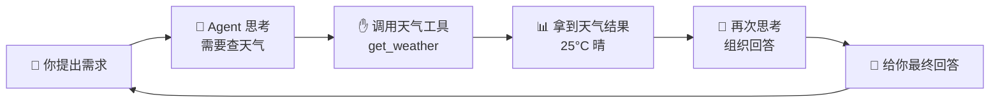
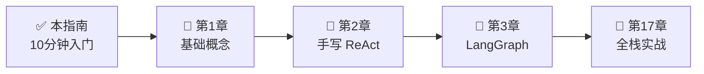

# 🚀 新手快速入门：10 分钟跑通你的第一个 AI Agent

> **目标读者**：完全没接触过 AI Agent 的零基础新手
> **耗时**：约 10 分钟
> **你需要准备**：一台能上网的电脑 + 一个 API Key（没有的话可以先用免费方案）

---

## 一、先搞懂：AI Agent 到底是什么？

### 用生活打个比方 🍳

想象你请了一个**全能管家**（AI Agent），他有三样东西：

```
┌─────────────────────────────────────────────────────────────┐
│                                                             │
│   🧠 大脑（大语言模型 LLM）                                   │
│   → 负责思考："主人想吃什么？"                                 │
│                                                             │
│   ✋ 双手（工具 Tools）                                       │
│   → 负责做事：查菜谱、打开冰箱、下单买菜                        │
│                                                             │
│   📒 记事本（记忆 Memory）                                    │
│   → 负责记住："主人不吃香菜""上次吃过火锅了"                    │
│                                                             │
└─────────────────────────────────────────────────────────────┘
```

**所以：AI Agent = 会思考（LLM）+ 会动手（Tools）+ 会记事儿（Memory）**

和普通聊天机器人（ChatGPT）的区别就是：**它能自己动手干活**，而不只是动嘴聊天。

---

### 再看一张流程图



**一句话总结**：Agent 就是"想一步、做一步、再看结果、再想"的循环，直到把事情办完。

---

## 二、环境准备（2 分钟）

### 方案 A：用本地 Python（推荐新手）

```bash
# 1. 安装 Python 3.10+（官网下载即可，记得勾选 Add to PATH）
#    下载地址：https://www.python.org/downloads/

# 2. 验证安装
python --version

# 3. 安装依赖
pip install openai python-dotenv
```

### 方案 B：用 Docker（不想折腾环境）

```bash
docker run -it --rm \
  -e OPENAI_API_KEY=你的key \
  -v $(pwd):/workspace \
  -w /workspace \
  python:3.11-slim bash -c "pip install openai python-dotenv && bash"
```

### 方案 C：完全免费不花钱（3 分钟）

> 使用国内免费可用的模型服务（如 DeepSeek、智谱 GLM、通义千问等，注册送额度）。
> 只需把下面的 `base_url` 和 `api_key` 换成对应平台的即可。

---

## 三、写你的第一个 Agent（5 分钟）

### 第 1 步：创建项目文件夹

```bash
mkdir my-first-agent
cd my-first-agent
```

### 第 2 步：创建配置文件 `.env`

```bash
# 创建一个 .env 文件，填入以下内容
OPENAI_API_KEY=sk-你的密钥
OPENAI_BASE_URL=https://api.openai.com/v1
# 如果你用国产模型，改成对应的地址，例如：
# OPENAI_BASE_URL=https://api.deepseek.com/v1
```

### 第 3 步：创建 `agent.py`（完整代码，直接复制）

```python
"""你的第一个 AI Agent - 一个会查天气和算数的智能助手"""
import os
import json
from dotenv import load_dotenv
from openai import OpenAI

load_dotenv()  # 读取 .env 里的配置

# ============ 1. 给 Agent 一双"手"（工具） ============

def get_weather(city: str) -> str:
    """查天气工具"""
    # 真实项目这里应该调用天气 API，我们先用模拟数据
    return f"{city}今天天气：晴，气温 25°C，适合出门！"

def calculator(expression: str) -> float:
    """计算器工具"""
    return eval(expression, {"__builtins__": {}}, {})

# 把工具"告诉"模型，让它知道能用什么
TOOLS = [
    {
        "type": "function",
        "function": {
            "name": "get_weather",
            "description": "查询指定城市的天气情况",
            "parameters": {
                "type": "object",
                "properties": {"city": {"type": "string"}},
                "required": ["city"],
            },
        },
    },
    {
        "type": "function",
        "function": {
            "name": "calculator",
            "description": "执行数学计算，比如 (1+2)*3",
            "parameters": {
                "type": "object",
                "properties": {"expression": {"type": "string"}},
                "required": ["expression"],
            },
        },
    },
]

# ============ 2. 给 Agent 一个"大脑"（LLM） ============

client = OpenAI()  # 会自动读取 .env 里的 key

def run_agent(user_input: str) -> str:
    """运行 Agent：思考 → 调用工具 → 给出答案"""
    messages = [{"role": "user", "content": user_input}]
    
    # 第一次调用：让模型决定是否需要工具
    response = client.chat.completions.create(
        model="gpt-4o-mini",  # 便宜好用，新手首选
        messages=messages,
        tools=TOOLS,
    )
    
    msg = response.choices[0].message
    
    # 如果模型想调用工具
    if msg.tool_calls:
        for tool_call in msg.tool_calls:
            name = tool_call.function.name
            args = json.loads(tool_call.function.arguments)
            print(f"🛠️ 正在调用工具: {name}({args})")
            
            # 执行对应的工具函数
            if name == "get_weather":
                result = get_weather(args["city"])
            elif name == "calculator":
                result = calculator(args["expression"])
            else:
                result = "未知工具"
            
            # 把工具结果返回给模型
            messages.append(msg)
            messages.append({
                "role": "tool",
                "tool_call_id": tool_call.id,
                "content": str(result),
            })
        
        # 第二次调用：让模型基于工具结果生成最终回答
        final = client.chat.completions.create(
            model="gpt-4o-mini",
            messages=messages,
            tools=TOOLS,
        )
        return final.choices[0].message.content
    
    return msg.content

# ============ 3. 跟你的 Agent 聊天吧！ ============

if __name__ == "__main__":
    print("🤖 你的第一个 AI Agent 已上线！")
    print("=" * 50)
    
    test_questions = [
        "北京今天天气怎么样？",
        "帮我算一下 (123 + 456) * 2 等于多少？",
    ]
    
    for q in test_questions:
        print(f"\n🙋 你问：{q}")
        answer = run_agent(q)
        print(f"🤖 Agent 答：{answer}")
```

### 第 4 步：运行！

```bash
python agent.py
```

### 你会看到类似输出：

```
🤖 你的第一个 AI Agent 已上线！
==================================================

🙋 你问：北京今天天气怎么样？
🛠️ 正在调用工具: get_weather({'city': '北京'})
🤖 Agent 答：北京今天天气晴朗，气温 25°C，适合出门！

🙋 你问：帮我算一下 (123 + 456) * 2 等于多少？
🛠️ 正在调用工具: calculator({'expression': '(123 + 456) * 2'})
🤖 Agent 答：(123 + 456) * 2 = 1158
```

🎉 **恭喜！你已经成功创建了人生第一个 AI Agent！**

---

## 四、代码逐行拆解（3 分钟看懂）

| 代码段 | 通俗解释 |
|--------|----------|
| `TOOLS = [...]` | 给 Agent 的"简历"，告诉它你有哪些技能 |
| `get_weather()` | Agent 的"手"之一，具体干活的人 |
| `client.chat.completions.create(...)` | 让"大脑"思考一次 |
| `msg.tool_calls` | 大脑说："我需要用工具！" |
| `messages.append(...)` | 把对话记录写进"记事本" |
| 第二次调用 | 拿到工具结果后，大脑组织最终回答 |

**核心心法**：Agent 编程 = 定义工具 + 循环调用 LLM + 传递上下文。

---

## 五、接下来学什么？

你已经入门了！推荐按这个顺序继续：



| 你的目标 | 推荐路线 |
|----------|----------|
| 想快速做个产品原型 | 第 7 章 Dify（拖拽就能做，不用写代码） |
| 想深入了解原理 | 第 2 章 手写 ReAct（从零实现） |
| 想开发生产级应用 | 第 3 章 LangGraph + 第 17 章实战 |
| 想本地免费跑模型 | 第 12 章 Ollama |
| 不知道选哪个框架 | 第 18 章 选型指南 |

---

## 六、新手常见问题（FAQ）

### Q1：没有 OpenAI 的 Key 怎么办？
答：可以用国产模型（DeepSeek、智谱、通义千问等），注册就送额度，把 `OPENAI_BASE_URL` 换成对应地址即可，代码不用改。详见第 12 章 Ollama 还能完全免费本地运行。

### Q2：报错 `ModuleNotFoundError: No module named 'openai'`
答：说明没装依赖。运行 `pip install openai python-dotenv` 即可。

### Q3：报错 `AuthenticationError`
答：`.env` 里的 API Key 填错了，检查是否有多余空格。

### Q4：Agent 一直调用工具停不下来怎么办？
答：在代码里加个步骤上限。我们在第 2 章手写 ReAct 时会详细讲解如何控制。

### Q5：eval 有安全风险吗？
答：有！上面示例为了简单用了 `eval`，生产环境请使用 `ast.literal_eval` 或专门的表达式解析库。详见 docs/最佳实践。

---

## 七、本指南配套示例

本项目的 `examples/01-react-agent/` 就是完整版示例，还带 SQLite 记忆功能：

```bash
cd examples/01-react-agent
pip install -r requirements.txt
python main.py
```

---

> **下一站**：翻到 [第 1 章：AI Agent 基础概念](01-fundamentals.md)，用 15 分钟彻底搞懂 Agent 的底层原理！

---

*本指南配套英文版：[English Quickstart](../en/chapters/00-quickstart.md)*
