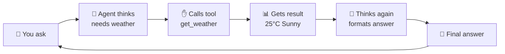
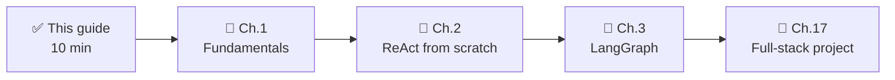

# 🚀 Quickstart: Build Your First AI Agent in 10 Minutes

> **Audience**: Complete beginners who have never touched AI Agents
> **Time**: ~10 minutes
> **You need**: A computer with internet + an API key (or a free option)

---

## 1. What is an AI Agent? (Plain English)

Think of an AI Agent as a **digital employee** with three things:

```
┌─────────────────────────────────────────────────────────────┐
│                                                             │
│   🧠 A Brain (LLM)                                           │
│   → Thinks: "What does the user want?"                       │
│                                                             │
│   ✋ Hands (Tools)                                            │
│   → Acts: check weather, search web, run calculations        │
│                                                             │
│   📒 A Notebook (Memory)                                      │
│   → Remembers: "User hates cilantro", "We had hotpot before" │
│                                                             │
└─────────────────────────────────────────────────────────────┘
```

**AI Agent = Thinking (LLM) + Acting (Tools) + Remembering (Memory)**

The difference from a chatbot (like ChatGPT): **it can DO things**, not just talk.

---

### The Flow



**In one sentence**: An Agent loops through "think → act → observe → think again" until the task is done.

---

## 2. Environment Setup (2 min)

### Option A: Local Python (recommended)

```bash
# 1. Install Python 3.10+ from https://www.python.org/downloads/
#    (Check "Add to PATH" during installation)

# 2. Verify
python --version

# 3. Install dependencies
pip install openai python-dotenv
```

### Option B: Docker (no environment hassle)

```bash
docker run -it --rm \
  -e OPENAI_API_KEY=your_key \
  -v $(pwd):/workspace \
  -w /workspace \
  python:3.11-slim bash -c "pip install openai python-dotenv && bash"
```

### Option C: Free options

> Many providers offer free trial credits (DeepSeek, Zhipu GLM, Qwen, Groq, etc.).
> Just change `base_url` and `api_key` in the code below.

---

## 3. Write Your First Agent (5 min)

### Step 1: Create a project folder

```bash
mkdir my-first-agent
cd my-first-agent
```

### Step 2: Create `.env`

```bash
OPENAI_API_KEY=sk-your-key
OPENAI_BASE_URL=https://api.openai.com/v1
# For DeepSeek: OPENAI_BASE_URL=https://api.deepseek.com/v1
```

### Step 3: Create `agent.py` (full code, copy-paste ready)

```python
"""Your first AI Agent - a weather + calculator assistant"""
import ast
import operator
import os
import json
from dotenv import load_dotenv
from openai import OpenAI

load_dotenv()

# ============ 1. Give the Agent "hands" (tools) ============

def get_weather(city: str) -> str:
    """Weather tool (mock data - replace with real API in production)"""
    return f"{city} today: Sunny, 25°C, great day to go out!"

# Safe math evaluation: never use eval() on untrusted input!
_SAFE_OPS = {
    ast.Add: operator.add,
    ast.Sub: operator.sub,
    ast.Mult: operator.mul,
    ast.Div: operator.truediv,
    ast.USub: operator.neg,
}

def _safe_eval(node):
    if isinstance(node, ast.Expression):
        return _safe_eval(node.body)
    if isinstance(node, ast.Constant) and isinstance(node.value, (int, float)):
        return node.value
    if isinstance(node, ast.BinOp) and type(node.op) in _SAFE_OPS:
        return _SAFE_OPS[type(node.op)](_safe_eval(node.left), _safe_eval(node.right))
    if isinstance(node, ast.UnaryOp) and type(node.op) in _SAFE_OPS:
        return _SAFE_OPS[type(node.op)](_safe_eval(node.operand))
    raise ValueError(f"Disallowed expression node: {type(node).__name__}")

def calculator(expression: str) -> float:
    """Calculator tool (safe: only numbers and basic arithmetic)"""
    return _safe_eval(ast.parse(expression, mode="eval"))

TOOLS = [
    {
        "type": "function",
        "function": {
            "name": "get_weather",
            "description": "Get the weather for a given city",
            "parameters": {
                "type": "object",
                "properties": {"city": {"type": "string"}},
                "required": ["city"],
            },
        },
    },
    {
        "type": "function",
        "function": {
            "name": "calculator",
            "description": "Evaluate a math expression like (1+2)*3",
            "parameters": {
                "type": "object",
                "properties": {"expression": {"type": "string"}},
                "required": ["expression"],
            },
        },
    },
]

# ============ 2. Give the Agent a "brain" (LLM) ============

client = OpenAI()  # reads key from .env

def run_agent(user_input: str) -> str:
    """Run the agent: think → call tools → answer"""
    messages = [{"role": "user", "content": user_input}]
    
    # First call: ask the model if it needs tools
    response = client.chat.completions.create(
        model="gpt-4o-mini",
        messages=messages,
        tools=TOOLS,
    )
    
    msg = response.choices[0].message
    
    # If the model wants to call a tool
    if msg.tool_calls:
        for tool_call in msg.tool_calls:
            name = tool_call.function.name
            args = json.loads(tool_call.function.arguments)
            print(f"🛠️ Calling tool: {name}({args})")
            
            if name == "get_weather":
                result = get_weather(args["city"])
            elif name == "calculator":
                result = calculator(args["expression"])
            else:
                result = "Unknown tool"
            
            # Send the tool result back to the model
            messages.append(msg)
            messages.append({
                "role": "tool",
                "tool_call_id": tool_call.id,
                "content": str(result),
            })
        
        # Second call: model generates the final answer
        final = client.chat.completions.create(
            model="gpt-4o-mini",
            messages=messages,
            tools=TOOLS,
        )
        return final.choices[0].message.content
    
    return msg.content

# ============ 3. Chat with your Agent! ============

if __name__ == "__main__":
    print("🤖 Your first AI Agent is online!")
    print("=" * 50)
    
    test_questions = [
        "What's the weather in Beijing today?",
        "What is (123 + 456) * 2?",
    ]
    
    for q in test_questions:
        print(f"\n🙋 You: {q}")
        answer = run_agent(q)
        print(f"🤖 Agent: {answer}")
```

### Step 4: Run it!

```bash
python agent.py
```

### Expected output:

```
🤖 Your first AI Agent is online!
==================================================

🙋 You: What's the weather in Beijing today?
🛠️ Calling tool: get_weather({'city': 'Beijing'})
🤖 Agent: Beijing today: Sunny, 25°C, great day to go out!

🙋 You: What is (123 + 456) * 2?
🛠️ Calling tool: calculator({'expression': '(123 + 456) * 2'})
🤖 Agent: (123 + 456) * 2 = 1158
```

🎉 **Congratulations! You just built your first AI Agent!**

---

## 4. Code Walkthrough (3 min)

| Code Section | Plain-English Meaning |
|--------------|----------------------|
| `TOOLS = [...]` | The Agent's "resume" — what skills it has |
| `get_weather()` | One of the Agent's "hands" — does actual work |
| `client.chat.completions.create(...)` | Ask the "brain" to think once |
| `msg.tool_calls` | The brain says: "I need to use a tool!" |
| `messages.append(...)` | Writing into the "notebook" (conversation history) |
| Second call | Brain forms the final answer using tool results |

**The core idea**: Agent programming = define tools + loop LLM calls + pass context.

---

## 5. What's Next?



| Your Goal | Recommended Path |
|-----------|------------------|
| Ship a prototype fast | Ch. 7 Dify (drag & drop, no code) |
| Understand the internals | Ch. 2 ReAct from scratch |
| Build production apps | Ch. 3 LangGraph + Ch. 17 |
| Run models locally for free | Ch. 12 Ollama |
| Choose a framework | Ch. 18 Selection Guide |

---

## 6. FAQ

### Q1: I don't have an OpenAI key.
Use free providers (DeepSeek, Zhipu, Qwen — they offer trial credits). Change `OPENAI_BASE_URL` and your code still works. See Ch. 12 for fully-free local models with Ollama.

### Q2: `ModuleNotFoundError: No module named 'openai'`
Run `pip install openai python-dotenv`.

### Q3: `AuthenticationError`
Your API key in `.env` is wrong. Check for extra spaces.

### Q4: Agent loops calling tools forever.
Add a max-steps limit. We'll cover this in Ch. 2.

### Q5: Is `eval` safe?
No! Never use `eval()` on untrusted input — it can execute arbitrary code. The example above uses an `ast`-based whitelist parser that only allows numbers and basic arithmetic. See docs/best-practices.md.

---

## 7. Companion Example

The full example at `examples/01-react-agent/` includes SQLite memory:

```bash
cd examples/01-react-agent
pip install -r requirements.txt
python main.py
```

---

> **Next stop**: [Chapter 1: AI Agent Fundamentals](01-fundamentals.md) — 15 minutes to understand the core concepts.

---

*Chinese version: [新手快速入门（中文版）](../chapters/00-quickstart.md)*
